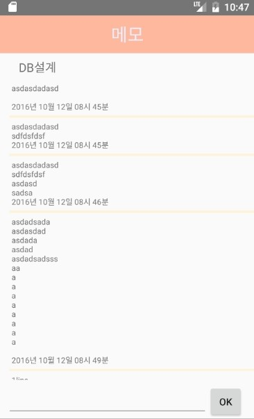

# DSCTimeTable
This project is the personal graduation work.

used IDE, Android Studio

Intranet(no code in GitHub): PHP, MySQL 5.1, Tomcat7

Android: jdk 1.8.0, sdk 24 targeted, SQLite
connected the temporary intranet and this application by JSON parsing.
 - PhpGet class used AsyncTask for that.
 - Resultly, it could get private user's ID,PW and timetable information from intranet.

# System Workflow
Web 
 
App 

  
# System Requirements Specification: login
Context Diagram 
  
Level1 Data Flow Diagram 
  
Level2 Data Flow Diagram 

  
# Example
Main 
  
First Visitor 
  
Timetable(Basic) 
  
Select timetable 
  
Memo 
  
Alarm execution 

 
